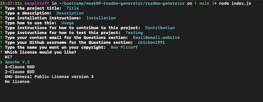
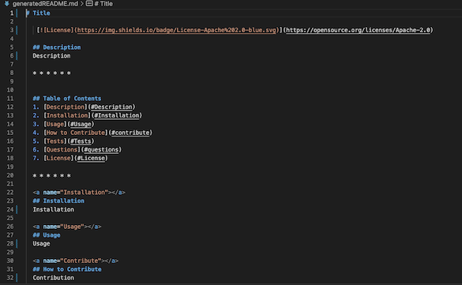
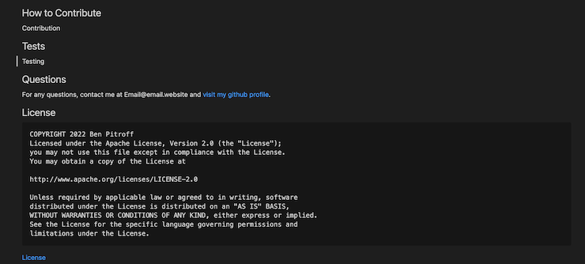

# Readme Generator

[](https://opensource.org/licenses/Apache-2.0)

## Description

This node.js app generates a professional readme file based on user input. It utilizes the Inquiere npm package to promt the user for cli input. 

* * * * * *


## Table of Contents
1. [Description](#Description)
2. [Installation](#Installation)
3. [Usage](#Usage)
6. [Questions](#questions)
7. [License](#License)

* * * * * *

<a name="Installation"></a>
## Installation

You must first have node.js installed on your machine, then intitalize and install the inquirer package in your working directory:
1. ~/> npm i
2. ~/> npm install inquirer -y

<a name="Usage"></a>
## Usage

Involk the index.js file with node:

> ~/> node index.js

Then answer each question. After the last question is answered, a new file 'generatedREADME.md' will be created at the root.

## [Follow this video for a usage tutorial](https://drive.google.com/file/d/1peUFs760dDQAb6UBq4js1NCNu2PXtQm_/view?usp=sharing)



* * * * *



* * * * *



<a name="questions"></a>
## Questions
For any questions, contact me at dev@chicken1991.anonaddy.com and [visit my github profile](https://github.com/d)

<a name="License"></a>
## License

```md
COPYRIGHT 2022 Ben Pitroff
Licensed under the Apache License, Version 2.0 (the "License");
you may not use this file except in compliance with the License.
You may obtain a copy of the License at

http://www.apache.org/licenses/LICENSE-2.0

Unless required by applicable law or agreed to in writing, software
distributed under the License is distributed on an "AS IS" BASIS,
WITHOUT WARRANTIES OR CONDITIONS OF ANY KIND, either express or implied.
See the License for the specific language governing permissions and
limitations under the License.
```   


[License](https://opensource.org/licenses/Apache-2.0)
